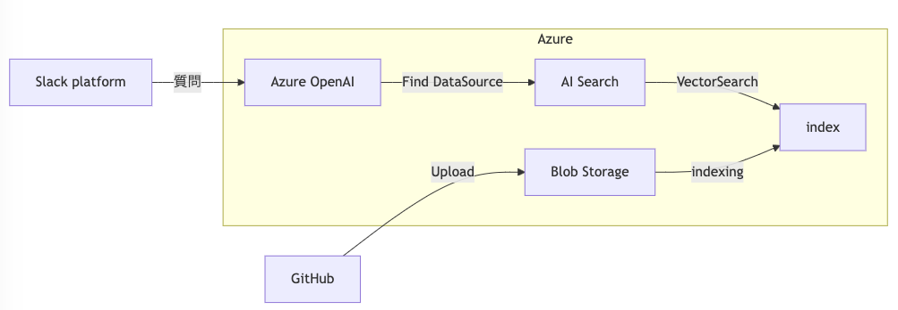

<!-- _class: cover -->

### LangChain Meetup Tokyo #5

# Slack Platform(Deno) での RAG 実装 - LangChain(js) を使ってみた

## Takeshi Kondo / @chaspy 

---

# はじめに

- いろいろ試した結果苦戦した話です
  - ぜひ皆様からのフィードバックやアドバイスをいただけますと幸いです

---

# 自己紹介

- Takeshi Kondo / @chaspy
  - Director of Engineering / 開発部長
  - 『スタディサプリ小学・中学・高校・大学受験講座』担当
  - Recruit co., ltd
- 先週月曜から今週火曜までカナダに行ってきました🇨🇦
  - お土産のチョコレートを持ってきたが食事できませんでした :sweat:
  

---

# 既存の Slack Bot + RAG

- 社内の markdown ドキュメントを検索して回答する
- Azure 上で構築
- chat/completions API で datasource を指定
- Slack Next Gen Platform (Deno/TypeScript)上で実行
- 詳細は過去資料参照
  - [「現場で実践！RAG活用術 Lunch LT ― 運用して分かった"つらみ"とその対策」で登壇してきました＆質問の回答 #RAG_Findy](https://blog.studysapuri.jp/entry/2024/07/17/feedback-cycle-practice-through-simplified-assessment-of-rags)

---

# 既存の Slack Bot + RAG

 
 
graph LR
    Slack[Slack platform] --> |質問|C

    subgraph Azure
        C[Azure OpenAI]
        C -->|Find DataSource| D[AI Search]
        E[Blob Storage]
        H[index]
        D-->|VectorSearch|H
    end

    G[GitHub] -->|Upload|E
    E -->|indexing|H

---

# 既存の Slack Bot + RAG の課題

- chat/completion API + DataSource なので、例えば index は1つしか指定できない
- 問い合わせ内容からクエリ生成や、問い合わせ内容に応じたフィルタリング・ソートなどができない
- 社内で使われるにつれ、より細かい制御 = Agentic RAG 風に作りたくなってきた
- API 呼び出しが増えて実装量増えるし、LangChain 使ってみよう

---

# LangChain(js) を使った上での課題

1. Python に比べて機能が少ない問題
2. Slack Deploy 時にバンドルエラーが出る問題
3. Deno がブラウザ扱いされてしまう問題

---

# 1. Python に比べて機能が少ない問題

- Azure AI Search の Retriever
  - Python はある https://python.langchain.com/docs/integrations/retrievers/azure_ai_search/
  - JS はない :cry:
- JS も Azure AI Search に対する各種操作は可能
  - https://python.langchain.com/docs/integrations/vectorstores/azuresearch/#configure-vector-store-settings
  - 結果 langchain の恩恵を生かしきれない

---

# 2. Slack Deploy 時にバンドルエラーが出る問題

- npm の場合、Slack Deploy 時に esbuild/deno-loader で依存を解決するが、うまく依存関係を解決できなかった
  - "NPM package not found"エラーが相次ぐ
- esm.sh 経由だと依存ライブラリ(langsmith)に関するエラー
  - error: Uncaught (in promise) SyntaxError: The requested module '../index.mjs' does not provide an export named '__version__' at https://esm.sh/langsmith@0.3.4/denonext/dist/utils/env.mjs:3:8
- import_map を使わずコード上で直接 import すると一応回避はできた

---

# 3. Deno がブラウザ扱いされてしまう問題
- esm 経由で入れると Azure へのアクセスができない
  - Error: proxyPolicy is not supported in browser environment
  - [@azure/openai の問題](https://github.com/Azure/azure-sdk-for-js/issues/28672)
  - ブラウザ向けのビルドが読み込まれてしまう
- ここで挫折しました :innocent:
  - 素直に API を呼ぶことにしました

---

# まとめ

- Deno + LangChain(js) + Azure AI Search の相性が（自分が試した範囲では）よくなさそう
  - Slack bot 作る上では Slack Platform は便利なので、Python で書けたら最高です...
- 今後は Agentic RAG の実装を頑張ります
- 別のプロダクトの方で Python の LangChain を使っているので、また事例作って話しにきます！

---

# Thank You!

- Takeshi Kondo / @chaspy
  - Director of Engineering / 開発部長
  - 『スタディサプリ小学・中学・高校・大学受験講座』担当
  - Recruit co., ltd
- marp でのスライド作成最高ですね

